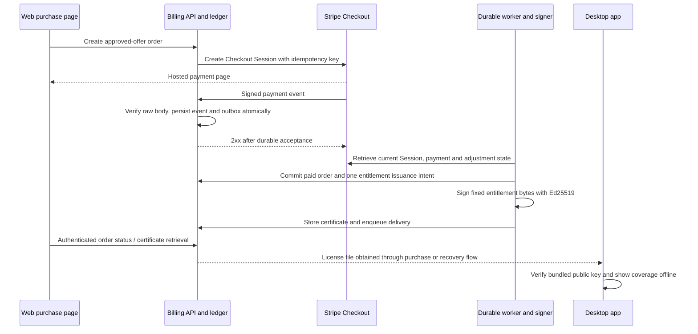

# ADR 0002: paid official desktop services with offline entitlements

Date: 2026-10-05. **Status: proposed architecture for the next implementation; no checkout, merchant configuration, entitlement service, or paid release exists.** Commercial terms and live activation require maintainer decisions and the evidence in [paid launch](../paid-launch.md). This extends [ADR 0001](0001-local-first-runtime.md) without changing the Apache-2.0 source license or making normal local work depend on a licensing server.

## Recommended offer

Offer a **$49 USD one-time purchase of official desktop distribution, 12 months of official updates, and 12 months of bounded support**, once the advertised platforms have signed and verified releases. Keep all acquired builds usable indefinitely. A later extension is a new, explicit purchase; no automatic renewal. The extension price is not decided. The first coverage period begins at the first successful entitlement issuance after confirmed payment; delayed fulfillment must not consume a customer's support period.

The local core, source builds, free preview, reading, editing, export, and backups remain available without a purchase. “License” in this design means an official distribution/update/support entitlement. It is not a license replacing Apache rights or an attempt to prohibit redistribution of Apache-covered code. The precise service contract, marks, and third-party notices need review before sale. The [Apache-2.0 text](https://www.apache.org/licenses/LICENSE-2.0) separately addresses copyright/patent grants, redistribution conditions, trademarks, and optional warranty/support obligations.

| Commercial alternative | Consequence | Recommendation |
| --- | --- | --- |
| $49 with 12 months of updates/support; keep obtained builds | Gives a defined period to budget operating costs; renewal is optional and does not interrupt work | Select for validation and implementation |
| $49 with all future updates and lifetime support | Creates an unbounded support/compatibility commitment without measured customer economics | Reject for the initial offer |
| Recurring subscription to use local tickets | Couples routine local work to billing and weakens the ownership proposition | Reject for the free local core |
| Optional hosted collaboration/managed AI subscription | Can fund ongoing hosted costs, but needs separate service and billing design | Preserve on the roadmap; do not bundle into $49 |

Twelve months means UTC calendar-month arithmetic, with the day clamped to the last valid day in the target month. Coverage is half-open: `[startsAt, endsAt)`. An official release is eligible when its immutable, signed `releasedAt` is earlier than `updatesUntil`; installation date and the user's clock do not redefine eligibility. Versions acquired while eligible keep working afterward. Supported operating systems, response targets, renewal terms, refund conditions, and archival-download retention must be published before sale. Do not promise all future operating systems or perpetual redownload hosting.

## Payment and storage boundaries

Use **Stripe-hosted Checkout for one-time payments**, an independently deployed Node billing API, a durable SQL order/event ledger, and an outbox worker. The Vercel landing page can initiate Checkout, but a static asset deployment is not the billing service. Provider/SQL hosting selection and operating cost remain open; do not use the desktop database, browser IndexedDB, process memory, or serverless filesystem as the order ledger.

Research on this date found Stripe API **`2026-09-30.endive`** and **stripe-node `23.0.0`** aligned in the official SDK. Recheck at implementation, pin the SDK, and align the configured webhook endpoint version. The installed skill's older API/SDK snapshot is superseded by this primary-source check. Use an instance-scoped client (`new Stripe(...)` in stripe-node), not a mutable global credential. [API versioning](https://docs.stripe.com/api/versioning), [SDK API version at v23.0.0](https://github.com/stripe/stripe-node/blob/v23.0.0/src/apiVersion.ts)

Use separate general Stripe sandboxes for development and CI, separate live resources later, and restricted API keys scoped to each backend role. A webhook signing secret is a distinct credential. None belongs in the web bundle, desktop app, MCP configuration, or workspace export. No account, sandbox, live Product/Price, or registration was provisioned for this ADR. [Sandboxes](https://docs.stripe.com/sandboxes), [API key types](https://docs.stripe.com/keys)

Proposed durable records:

- `orders`: opaque UUID, environment, offer/version, expected Price ID/currency/subtotal, permitted platform, checkout attempt, unique Checkout Session ID, unique PaymentIntent ID, payment state, contact reference, policy versions, creation/update timestamps.
- `stripe_events`: unique `(environment, Stripe account, event.id)`, event type/object reference, encrypted short-lived input or minimum normalized payload, processing state, attempts, next attempt, failure reason. API/event version is recorded.
- `entitlements`: unique initial order ID, random entitlement ID, pseudonymous purchaser ID, entitlement generation, coverage dates, current commercial status, issuing key ID, exact signed bytes, issuance/reissue reason. A renewal references the same entitlement and its own unique paid order.
- `refunds` and `disputes`: unique provider object IDs, current retrieved state, amount/currency, affected order, observed timestamps. Do not order business transitions solely by webhook timestamps.
- `outbox`: unique operation keys for reconcile, issue, and notify; pending/leased/done/error states, lease expiry, bounded attempts. Notification delivery is independent of entitlement issuance.
- `recovery_challenges`: hash of a random single-use token, order/purchaser reference, expiry, consumption timestamp; no plaintext token at rest.

DB transactions and uniqueness enforce business idempotency. A queue improves delivery but does not replace those constraints. A leased worker must safely resume after a crash; jobs are never “done” before their durable effect commits.

## Checkout to fulfillment



1. `POST /api/commerce/checkout` accepts an offer key and selected supported platform, never a client-supplied amount, Stripe Price ID, redirect destination, or coverage date. Check `salesEnabled`, supported platform release evidence, origin/CSRF, rate limits, and the server-side catalog. Create a UUID order and a hashed random purchase-context secret; deliver the latter only as an HttpOnly, Secure, SameSite=Lax cookie. Cookie scope is the commerce paths, with a proposed 24-hour lifetime. Avoid logging cookies or payment bodies.
2. Create a hosted Session with `mode: payment`, `ui_mode: hosted_page`, one allowlisted Price at quantity one, `client_reference_id: order.id`, and matching internal metadata on the Session/PaymentIntent. Use fixed configured success/cancel URLs. The success URL may contain `{CHECKOUT_SESSION_ID}`, but this is a lookup hint, not authentication. Set a stable integration label with an eight-random-letter suffix per deployment. Omit `payment_method_types` so configured dynamic methods remain available. Initially disable discounts/promotion codes and Adaptive Pricing so the approved USD offer can be reconciled predictably. Retrieve the actual SKU and validate these configuration assumptions before live sale. [Checkout Session creation](https://docs.stripe.com/api/checkout/sessions/create)
3. Use `checkout:<environment>:<order-id>:<attempt>` as the Stripe idempotency key. Persist the exact parameters and returned Session ID. Retries reuse this key and parameters. An expired or explicitly abandoned attempt gets a new numbered attempt only after reconciliation; never blindly mint a new charge attempt after a network timeout. Stripe's idempotency cache is not a permanent order ledger and may be pruned after at least 24 hours. [Idempotent requests](https://docs.stripe.com/api/idempotent_requests)
4. `POST /api/commerce/stripe-webhook` receives the raw request bytes. Verify `Stripe-Signature` with the instance SDK, endpoint-specific secret, and nonzero timestamp tolerance. Validate environment/account and the configured event allowlist. Insert the event and a reconcile outbox operation in one transaction; return 2xx only after that durable commit. Invalid signatures return 400; persistence failure returns 5xx for retry; already accepted duplicates return 2xx. This route uses signature verification rather than a customer cookie or CSRF token. Stripe documents retries, duplicate events, unordered delivery, raw-body requirements, and asynchronous processing. [Webhooks](https://docs.stripe.com/webhooks)
5. Reconcile `checkout.session.completed` and `checkout.session.async_payment_succeeded`. Retrieve current Session with line items and its PaymentIntent using the correct environment. Require the recorded order, known Session, expected Price/product/quantity, `mode=payment`, `status=complete`, **`payment_status=paid`**, and a successful associated payment. For this nonfree SKU, `unpaid` and `no_payment_required` do not issue a license. Check approved USD subtotal of 4,900 cents, no unexpected discounts, consistent payment totals, and applicable tax results; total can exceed subtotal for exclusive tax. A completed Session with a pending method stays pending. Handle asynchronous failure and expiration without revoking a previously reconciled successful payment. Never grant access from the success page. [Checkout fulfillment](https://docs.stripe.com/checkout/fulfillment?payment-ui=stripe-hosted)
6. Lock the order and entitlement rows, fetch/reconcile relevant refund/dispute state, and commit exactly one issuance intent. The worker signs its stored payload and writes the resulting certificate once. A crash before storing can repeat deterministic signing of the same bytes; it must not recalculate coverage dates or create a second entitlement. Concurrent completed/async events converge on the same order. A successful issuance enqueues receipt/license delivery separately; mail failure cannot duplicate a charge or license.
7. `GET /api/commerce/orders/<opaque-id>` verifies purchase-context possession and returns only safe status. A certificate download requires that context or an authenticated recovery session. Do not reveal customer email, Stripe objects, or a certificate to anyone with a Session ID alone. The confirmation page can say “Payment received; preparing your license” and poll with bounded backoff. Closing it never prevents fulfillment.

## Signed entitlement format and offline behavior

Use Ed25519 with separate entitlement-signing and application-release-signing keys. The server holds the private entitlement key; desktop builds contain only a versioned allowlist of public keys. Node supports Ed25519 key generation and `sign(null, bytes, key)` / `verify(null, bytes, key, signature)`; use the public SPKI/private PKCS8 formats supported by the selected deployed Node/Electron versions. Do not require newer optional algorithm context APIs. [Node 24 crypto](https://nodejs.org/docs/latest-v24.x/api/crypto.html#cryptosignalgorithm-data-key-callback)

Proposed bounded JSON envelope:

```json
{
  "format": "zettel-entitlement-v1",
  "keyId": "public-key-id",
  "payload": "base64url-of-exact-UTF8-JSON-bytes",
  "signature": "base64url-of-64-byte-Ed25519-signature"
}
```

The signed message is the UTF-8 bytes of `zettel-entitlement-v1\n<keyId>\n<payload>`. Thus key identity and format are bound to the signature. The verifier accepts only that fixed format and Ed25519, an allowlisted key ID, strict base64url, a maximum 16 KiB envelope, and a 64-byte signature. It verifies the exact received encoded payload before decoding and schema validation; it does not reserialize JSON to verify. No network key URL, algorithm choice, imported code, or remote trust root is accepted from the file.

Payload fields: `schemaVersion: 1`, `issuer`, `audience: "zettel-official-desktop"`, environment, random `entitlementId`, pseudonymous `purchaserId`, `generation`, `offerVersion`, `issuedAt`, `coverageStartsAt`, `updatesUntil`, `supportUntil`, and explicit service grants. Require bounded identifiers and valid ordered UTC timestamps; reject unknown schemas. Do not include email, billing address, workspace ID/content, provider keys, or card/payment identifiers. Store the exact original envelope separately from workspace backups. Signing provides authenticity, not confidentiality.

“Activate” means import and locally verify this file. It does not require a launch-time network request, collect hardware identifiers, or change workspace storage. The proposed initial offer serves one named purchaser across their own computers, without a hard device fingerprint or online activation quota. The commercial service contract can address credential sharing; enforce abuse policy at official download/support endpoints, not by disabling Apache-covered code.

The app displays `Official entitlement: verified offline` and coverage dates, with an explicit distinction between offline signature validity and current server status. A local clock cannot extend the signed update cutoff: release eligibility uses a separately signed release timestamp. Clock anomalies may affect a status label, but never local read/edit/export. Missing, malformed, expired-service, refunded, or revoked credentials leave the free workspace fully usable. A new release outside coverage offers an optional renewal and the existing build; it does not force an update, downgrade, or destructive database migration.

Official update/download/support APIs check current server entitlement status, not only certificate signature. A downloaded public-key-verifiable file cannot be reliably revoked on a permanently offline computer. Accept this limitation explicitly. A refund can stop future official services online; it cannot remotely erase existing software, data, or Apache rights. Key rotation and revocation are service-security mechanisms, not DRM guarantees.

## Refunds, disputes, reconciliation, and recovery

Listen to `refund.created`, `refund.updated`, `refund.failed`, `charge.refunded`, `charge.dispute.created`, and `charge.dispute.closed`, alongside the Checkout events. Retrieve current provider objects before state changes. Pending/failed refunds are not a successful returned payment; partial refunds do not automatically cancel the whole entitlement. A completed full refund ends future official services under the disclosed policy. A dispute can temporarily suspend new paid downloads/support while reviewed; a won/reversed outcome restores the appropriate remaining coverage. Handle later changes rather than making “lost” or an event timestamp an irreversible terminal truth. Existing local work remains unaffected. [Refund lifecycle](https://docs.stripe.com/refunds), [dispute lifecycle](https://docs.stripe.com/disputes/how-disputes-work)

Use one state reducer shared by webhooks, manual authorized adjustments, and a scheduled reconciliation worker. Proposed internal retry schedule: 1 minute, 5 minutes, 30 minutes, 2 hours, then bounded periodic retry; alert on payment awaiting issuance beyond 15 minutes and unresolved delivery beyond 24 hours. These are product service targets to validate, not Stripe guarantees. Reconcile pending orders and recent adjustments at least daily; retain dedupe/financial records beyond provider retry windows according to the adopted retention policy. Do not acknowledge and drop work or rely on an unawaited serverless promise.

Recovery accepts an email and always gives the same public response. Send a single-use, hashed, short-lived recovery challenge only to the purchase address on the verified order. Verify the challenge before showing orders or reissuing a file. A leaked purchase Session ID is insufficient. Rate-limit by contact hash and coarse abuse signals; do not store workspace data or a hardware fingerprint. Email change/recovery without access requires a documented human proof-of-purchase process, logged adjustments, and no collection of full card details. Email-delivery configuration and recovery tests are launch dependencies.

A signing-key incident stops new issuance, rotates server access and the issuing key, audits generated certificates, and reconciles customer records. Keep an encrypted recoverable copy of old public keys and authorized issuance history. Reissue valid purchases through authenticated recovery. New builds carry an updated keyring; online services can deny compromised credentials immediately, while old offline clients cannot be promised immediate revocation. A signing provider must actually support Ed25519; do not assume every KMS does. An encrypted PKCS8 secret in narrowly scoped server secret storage is the initial alternative, with a recorded access/rotation/recovery plan.

## Launch constraints and consequence

This approach adds a real operated service: durable billing data, transaction/outbox workers, mail, signing-key custody, recovery, tax/consumer-policy decisions, and support. The selected 12-month commitment bounds the offer better than lifetime future services, but does not prove profitability or demand. Required setup, proposed environment names, implementation tickets, and failure-oriented tests are in [paid-launch.md](../paid-launch.md). No live sales until the supported platform's official artifact is signed, installed, restarted, restored, and verified through the complete sandbox purchase flow.
